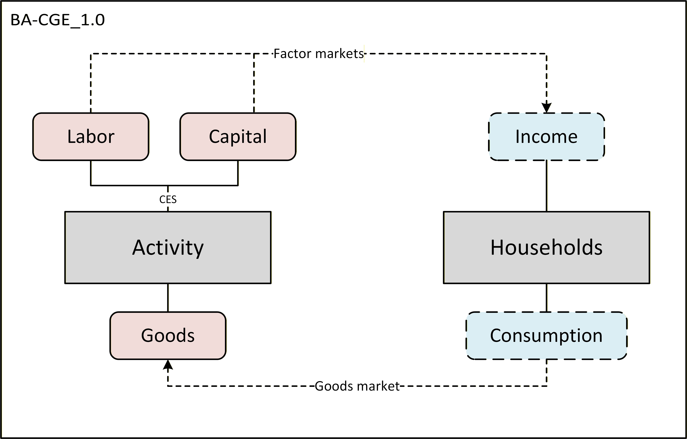
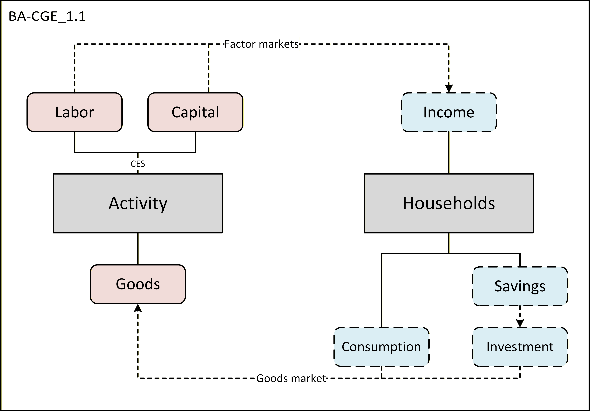
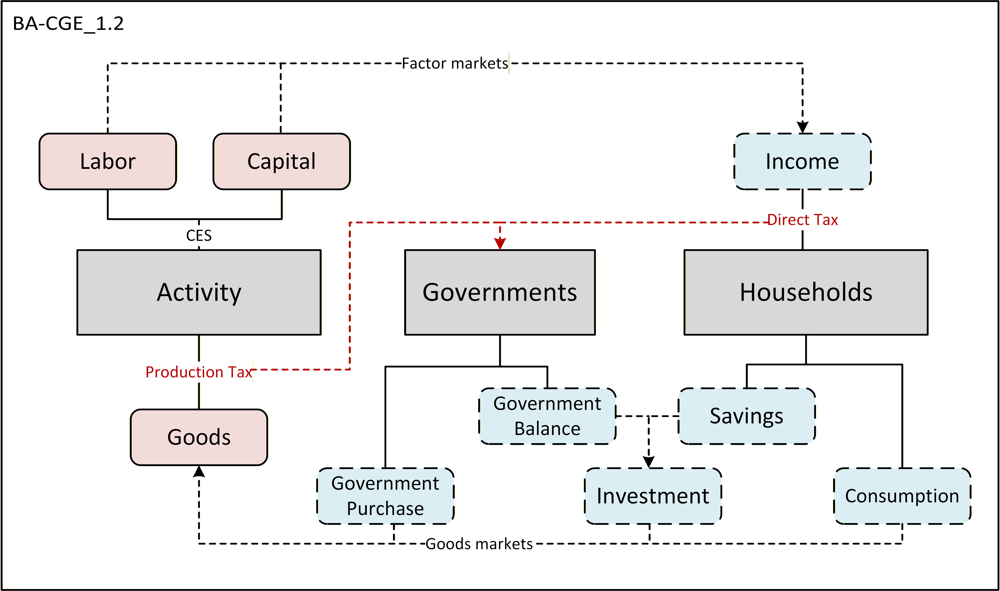
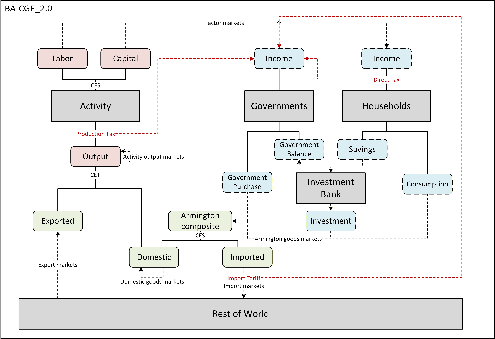

## BA-CGE

This is a new CGE series under DG(E)-CGE model family. The reason we plan to build such a new but simple series mainly lies in pedagogical sense. From developing such a basic series, it is expected to: 1.provide a systematic and comprehensive understanding into the underlying ideology of general equilibrium models; 2.offer a convenient and flexible platform to test many new ideas and mechanisms, thus to improve the efficiency of model variations.

### BA-CGE_1.0.0

This primary model features the most basic general equilibrium mechanisms, with only one region, one sector, two factors (labor and capital). There is a household getting income by supplying factors, and consuming the produced goods following the utility maximization. No governments, savings-investments, nor exports/imports are included. The model is static and only considers local period optimization. In total, there are three markets: goods, labor and capital. Although it is an extremely simple model framework, it strictly follows the general equilibrium theory and embodies the Walras’ law by setting a price as numeraire and drop the corresponding market clearing condition.

The code structure is streamlined following DG(E)-CGE series models. Since the model is still small and codes are relatively short, we use a single .gms file to code the whole model. The 1.0.0 version is a starting point for subsequent versions to incorporate more updated and complex features that are specified for applications.

### BA-CGE_1.0.0a

This version maintains the same internal structure as 1.0.0, with the only difference being the formulating of equations. We explicitly write out all demand functions, supply functions and market clearing conditions. This helps readers to better understand the basic ideology of CGE models: Firms will determine their factor demand (through conditional factor demand functions) and goods supply (through supply functions), while households determine their conditional goods demand (subjected to budget constraint) and their factors supply (under default macro closures, exogenous). Finally, market clearing determines the prices of all goods and factors. Note that the subsequent versions will not adopt equations structures like this, instead they will be developed based on 1.0.0.

### BA-CGE_1.0.0b

This version is based on 1.0.0, but we have changed the SAM structure and calibrate the production function into a decreasing returns-to-scale one. In this model, firms may earn positive profits because the marginal production cost no longer remains constant. Therefore, we add a new variable, ‘F’, to represent the profits earned by firms. We also modify the conditional factor demand functions (L_eq, K_eq) and the supply function (P_eq) in production module. Now, the supply function (P_eq) explicitly contains the relationships between output levels (Q) and prices (P,W,R). The profits earned by firms are recorded in (‘hhd’,’act’) account in SAM. The decreasing returns-to-scale means that the sum of prime share parameters (alpl and alpk) is smaller than 1.

### BA-CGE_1.0.0c

This version also features a decreasing returns-to-scale production function. The main difference from 1.0.0b is the algebraic implementation. While 1.0.0b uses a non-standard C-D (alpl+alpk<1) function, in 1.0.0c we employ a ‘deflator’ approach, where we power a ‘returns-to-scale deflator’ outside the standard C-D function. This constitutes a homothetic (but not homogenous) production function. The main advantage of this approach is that it can be easily generalized into CES function with arbitrary number of factors.

### BA-CGE_1.0.0d

This version makes some improvements on the basis of version 1.0.0. There are two main differences: 1. The model expression is changed from non-linear equalities into inequalities, which is the so-called MCP form. We have categorized model equations into three groups: zero-profit conditions, market clearance conditions, and others. We make some modifications to notations and descriptive statements, so as to improve the clarity.

### BA-CGE_1.0.1

On the basis of 1.0.0, we extend the model by introducing saving-investment mechanism in households behavior. In 1.0.1, households income will split to savings and disposable incomes (for consumption). Households have a C-D utility function, resulting in a fixed budget share of consumption and savings (i.e., the saving propensity is fixed). Households savings are then transformed to investments directly. Households consumption and investment expenditures face the same goods price in the same goods market. Therefore, the goods market clearing condition is modified by adding the demand from investments. There are still three markets. Goods price is still used as numeraire by default and, correspondingly, we drop the market clearing condition by adding the dummy WALRAS variable. Note that in this version, the dummy variable can be added to market clearing equation (P_eq), or equivalently, to savings-investment balance equation (I_eq). That’s because the consumption and investment are pooled into a single market, and face the same price. Thus, the ‘investment’ goods and normal consumption goods are actually homogenous and share the same market clearing condition.

### BA-CGE_1.0.2

This version is further extended from 1.0.1 by incorporating governments. In 1.0.2, there is a government in this economy whose behavior is to levy two taxes: production tax and direct tax, and to do government purchases using its tax income. We add two new accounts in SAM table: PTX (production tax) and GOV (governments).

We also update the nomenclature for most variables and equations, and restructure the model codes to make it modularized. From this version, we are going to gradually transit to the nomenclature style of standard DG-CGE series. All quantity variables (labor, capital, goods) are initiated by ‘Q’, all price variables (wages, rents, goods price) are initiated by ‘P’, and all value variables (income, expenditures) are initiated by ‘Y’. Other special variables (tax rates or others) are named separately. Now we split the model into 5 modules: Production, Agents consumption, Agents income & allocation, Endowments supply, and Closure.

The macro closure still follows previous versions, because there is still only one good. The goods price PA is set as numeraire and accordingly PA_eq is dummied. The standard government closure involves fixed tax rate, fixed government purchase, and endogenized government balance (savings). An alternative closure is to fix government balance and endogenize purchase or direct tax rate. The standard investment-savings balance closure fixes households savings propensity and endogenizes real investment quantities. An alternative closure is to swap these two variables (endogenize savings propensity to meet a given investment target).

### BA-CGE_1.0.3

This version transits from closed economy into open economy. We add three new accounts into SAM table: COM (commodity), MTX (import tariff), and ROW (rest of world). In this version, output from domestic firms will be first separated into domestic sold and exports through a CET function. The former will be pooled together with imported goods to form ‘composite goods’ through Armington nest, which will then be circulated in domestic market to satisfy demand from households, government and investments. In terms of export and import balance, we follow the ‘small-open-economy’ assumption and assume world prices are fixed, and export and import prices are directly determined by world price and domestic price numeraire (which serves as ‘exchange rates’ and reflects domestic price level). Investments are now sourced from households savings, government savings, and net foreign savings (which are determined by difference between import values and export values). There is also a new tax, the import tariff, that is levied by government. It increases the import price and contributes to government revenues.

In this version, the market structure is more complicated than previous versions: there are still two factor markets, but the number of goods markets increases to five. Although there is still only one ‘type’ of good, we assume there are heterogeneities among domestic sold, exported and imported goods. Therefore, the five goods markets include: 1.domestic output goods (PA); 2.exported goods (PE); 3.domestic produced and sold goods (PD); 4.imported goods (PM); 5.armington composite goods (PC). We will use Armington composite price PC as numeraire, and correspondingly, PC_eq is dummied.

We also make some improvements to code structures. Now in Model Solution block, we separate baseline replication and shocks simulation. After we solve the baseline model, we record the base levels into parameters (e.g., QL0=QL.l). Then, after shock simulations, we construct ‘checking’ parameters to reflect percentage changes in variables (e.g., qlck = (QL.l-QL0)/QL0). We also adjust some nomenclatures to facilitate understanding, and make some detailed changes.

### 2025.12.15: Major update

We have made some important updates on Basic CGE series, primarily including:

1. An overturn of the naming convention: now, we set version 1.0.0d as 1.0 (we will explain why in the follows), 1.0.1 as 1.1, 1.0.2 as 1.2, and 1.0.3 as 1.3.

2. From now on, the default expression form of Basic CGE models will be changed into non-linear inequalities (i.e., MCP). The first inequality version of CGE is 1.0.0d. We will modify all sub-sequent versions following this version.

3. There are also many additional features in version 1.0 (previous 1.0.0d), including the introduction of time subscripts, which enables multiple shock simulations in one execution; also, the production function is modified into more general CES form, which allows for non-unitary and unitary sub-elasticity (C-D); the introduction of technical shifters allows to test the impacts of technology improvements.

4. Many descriptive statements are improved to keep in line with mainstream literature.

We will go through the new Basic CGE model series again to better fit us into the new streamline. More detailed model descriptions on all BA-CGE versions are now formally documented in Theoretical basis revisited.docx.

### BA-CGE_1.0

This is a simple single-region, single-sector, two-factor, close-economy CGE model. The firm maximizes its profit subjected to constant return-to-scale CES technology. The households exhaust its income (no savings), and maximize its utility (following a log function) subjected to the budget constraint. There are no governments, investments, nor the exports/imports. In total, there are three markets: the goods market & two factor markets.

(For algebraic expressions of version 1.0, refer to BA_CGE_document.pdf)

### BA-CGE_1.1

This is a simple single-region, single-sector, two-factor, close-economy CGE model. The firm maximizes its profit subjected to constant return-to-scale CES technology. The households allocate a fixed proportion of its income as savings, which turn to investments, and then maximize its utility (following a log function) subjected to the budget constraint. There are no governments, nor the exports/imports. In total, there are three markets: the goods market & two factor markets.

### BA-CGE_1.2

This is a simple single-region, single-sector, two-factor, close-economy CGE model. The firm maximizes its profit subjected to constant return-to-scale CES technology. The households allocate a fixed proportion of its income as savings, which turn to investments, and then maximize its utility (following a log function) subjected to the budget constraint. The government levies a production tax and a direct tax, and uses its income to purchase. It may operate with a constant (under FixGovSave) or flexible (under FixGovCons) fiscal surplus. There are no exports/imports. In total, there are three markets: the goods market & two factor markets.

### BA-CGE_2.0

This is a simple single-region, single-sector, two-factor, open-economy CGE model. The firm maximizes its profit subjected to constant return-to-scale CES technology. The households save a fixed proportion of its income into the bank, and then maximize its utility (increasing & convex) subjected to the budget constraint. The government levies a production tax, a direct tax & an import tariff, and uses income to purchase. It operates with a constant fiscal surplus by lending to/borrowing from the bank. The bank absorbs households savings & government net surplus, and forms investment. Imports are specified using Armington assumption, while exports follow the CET function. In total, there are seven markets: five goods markets (activity output, exports, domestic goods, imports, composite goods) and two factor markets.

Developer’s note: 1. Before the formal 2.0 version, I first launched two beta versions. The main reason is: in the formal 2.0 version, you can see that the market clearance conditions of PA and PD are not very ‘conventional’. That’s because there are in fact two QA (from the supply side: QAs, and the demand side: QAd), and also, two QD. I explicitly distinguished these two variables (i.e., QAs&QAd, and QDs&QDd) in beta versions, because that helps me better understand the market clearing conditions, and preserves the canonical model structures. In the formal version, however, I only keep one side of these variables (i.e., QA and QD), and simplify the model by ‘substituting’ the zero-profit condition (of QA) into PA market clearing, and the conditional demand function (of QD) into PD market clearing.

2. I made a stupid mistake by typing ‘PC’ into ‘PA’. That makes WALRAS not equal to 0 and I spent nearly an hour to find out why.

3. I found that when the elasticity of transformation in export CET function is not infinity, you cannot fix the export supply volume (QE=eb), otherwise the WALRAS is not 0. Also, you cannot let the elasticity of substitution between labor and capital be 0 (esubt=0), because that causes errors when solving.